---

marp: true

---

# Conditions and Loops

---

<!-- paginate: true -->

# Outline

- Condition with `v-if` and `v-if-else`
- Loop with `v-for`
- Sorting

---

# Last time
* we created a 'checkout' button that toggles a property called `showProduct`. 
* We used the `v-if` and the `v-else` so 
    * If `showProduct` was `true`, the 'product' page was displayed;
    * if `showProduct` was `false`, the 'checkout' page was displayed. 
* By clicking the 'checkout' button, users can easily switch between these pages.

---

```html
...
<!-- the 'checkout' button -->
<button v-on:click='showCheckout'>...</button>
...
<div v-if='showProduct'>
    <!-- the 'product' page -->
    ...
</div>
<div v-else>
    <!-- the 'checkout' page -->
    ...
</div>
```

```js
// the 'methods' of Vue instance
methods: {
    ...
    showCheckout() {
        this.showProduct = this.showProduct ? false : true;
    },
    ...
}
```

---

# Adding how many are left with `v-if`

* Let the user know how many are available
  * Display a few messages when the available inventory is almost out
* First, let's increase the inventory from 5 to 10:
```js
product: {
  id: 1001,
  title: "Cat Food, 25lb bag",
  description: "A 25 pound bag of ...",
  price: 2000,
  image: "assets/images/product-fullsize.png",
  availableInventory: 10  // was '5' 		
},
```

--- 

* When inventory is less than 5, we display a message showing how many are left.

```html
<button v-on:click='addToCart' v-if='canAddToCart'>
    Add to cart
</button>
<span v-if="product.availableInventory - cartItemCount < 5">
    Only {{product.availableInventory - cartItemCount}} left!
</span>
```
* For `v-if`, here we use an expression instead of a vue property.
* It is also possible to define `product.availableInventory - cartItemCount` as a computed property.

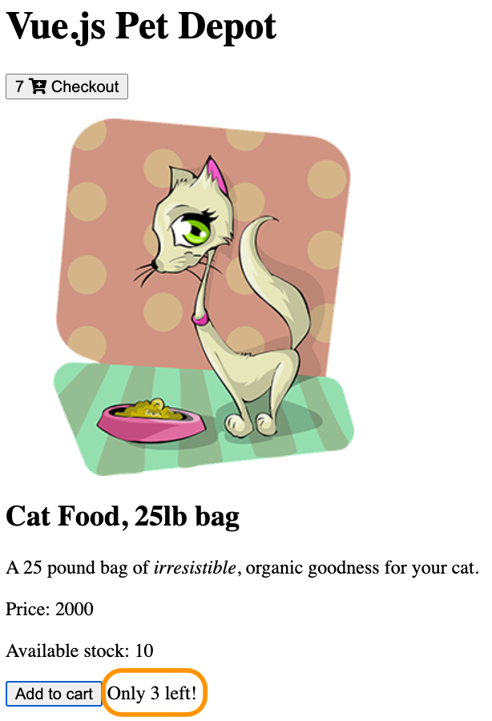

---

# More message with `v-else` and `v-else-if`

* When the inventory reaches 0, the message displays “Only 0 left!”
  * That doesn’t make sense
  * Let's add a message that encourages the user to buy now
* We will use `v-else-if`

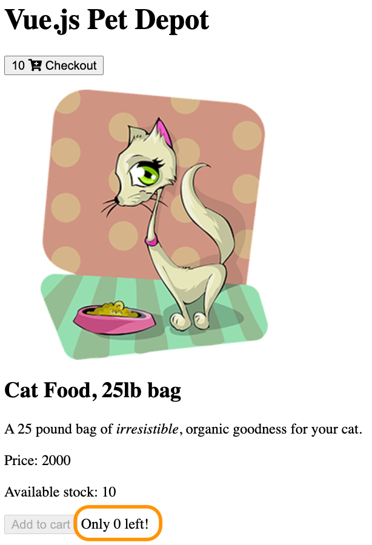

---

```html
<span v-if='product.availableInventory 
    === cartItemCount'>
    All out!
</span>
<span v-else-if="product.availableInventory 
    - cartItemCount < 5">
    Only {{product.availableInventory 
    - cartItemCount}} left!
</span>
<span v-else>Buy now!</span>
```
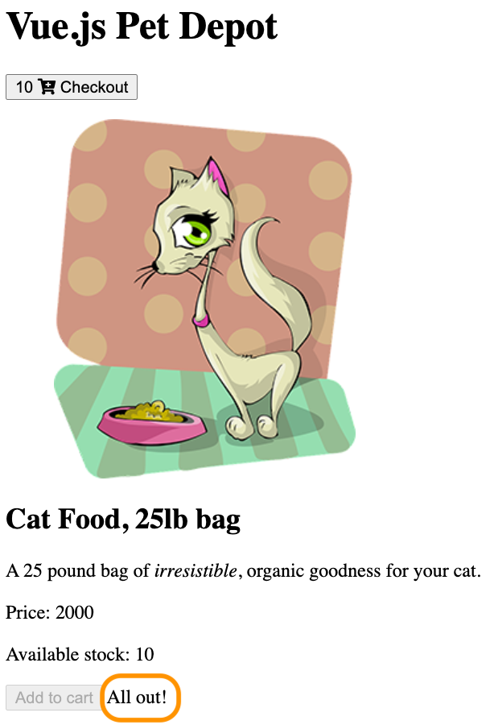

* `v-if`: when no more left, show 'All out`
* `v-else-if`: when inventory < 5, show how many left
* `v-else`: when inventory >= 5, show 'Buy now`
* An alternative is to use a function to decide what message to display.

---

# Outline

- Condition with `v-if` and `v-if-else`
- **Loop with `v-for`**
- Sorting

--- 

# Previously

- We used `v-for` for the list of options in a dropdown menu

```html
<select v-model="order.state">
    <option disabled value="">State</option>
    <option v-for="(state, key) in states" 
        v-bind:value="state">
        {{key}}
    </option>
</select>
```
```js
data {
    states: {
        AL: 'Alabama',
        AR: 'Arizona',
        CA: 'California',
        NV: 'Nevada'
    },
}
```
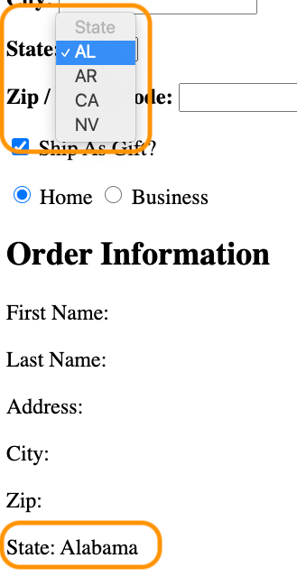

---

# Today we will use `v-for` to 

- Add a five-star rating system
- List all the products in an array

---

# Adding a star rating with v-for range

* One ways to use the `v-for` is by giving it an integer.
* When added to an element, it will be repeated that many times, 
* This is known as a *`v-for` range*.
* Add a 5-star rating system:

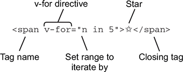
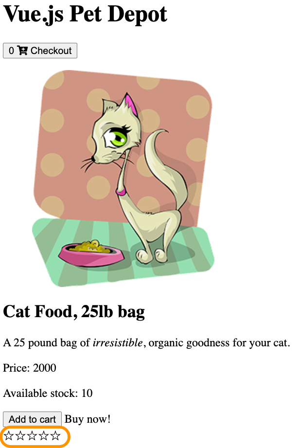

---

# Add rating to product information

```js
data: {
    ...
    product: {
        ...
        rating: 3
    }
}
```

---

# Use filled stars to represent rating

* A rating of 3 will have 3 filled stars and 2 empty ones
* We achieve this by first repeat the filled star the 'rating' number of times
* Then empty star '5-rating' number of times
```html
<div>
    <span v-for='n in product.rating'>★</span>
    <span v-for='n in 5-product.rating'>☆</span>
</div>
```
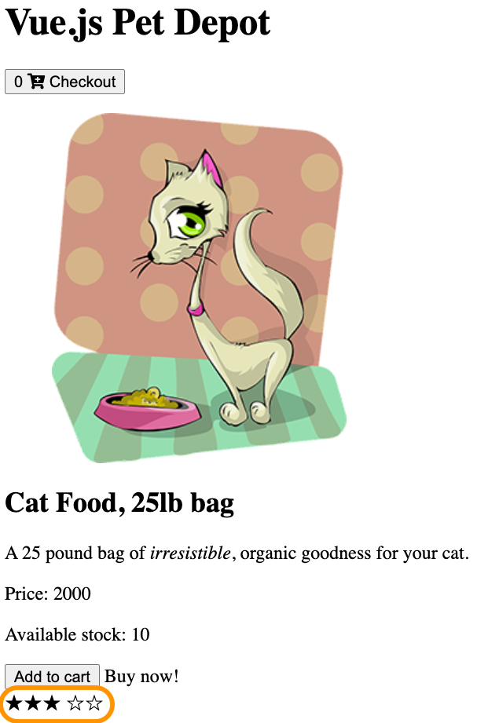

---

# There are many ways to achieve this

* The example in the textbook uses CSS class to achieve similar effect.
  * Filled star and empty star has different css class
* The star symbol can also be achieved with the Font Awesome icon we discussed before.
* Or you can just show the filled stars.

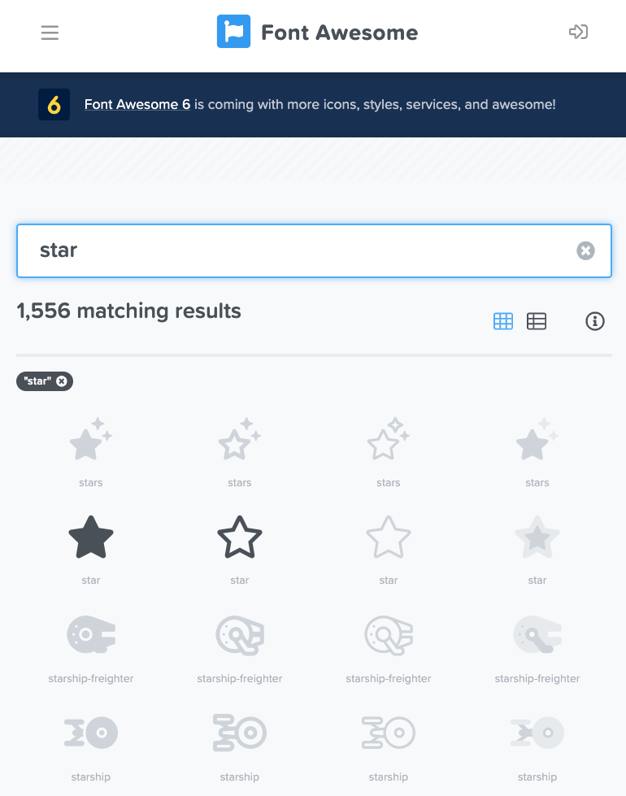

---

# Today we will use `v-for` to 

- Add a five-star rating system
- **List all the products in an array**

---

# Adding more products
```js
"products" = [
    {
      "id": 1001,
      "title": "Cat Food, 25lb bag",
      "description": "A 25 pound bag of irresistible, 
        organic goodness for your cat.",
      "price": 2000,
      "image": "assets/images/product-fullsize.png",
      "availableInventory": 10,
      "rating": 1
    },
    { "id": 1002, ... },
    { "id": 1003, ... },
    { "id": 1004, ... },
    { "id": 1005, ... }
  ]
  ```

  --- 

* The `products` array is stored in a new JavaScript file `products.js`
  * So out main html/javascript file does not get too long
* The `products.js` needs to be loaded into our main html file
  * Just as any other JavaScript file or library
  * `<script src="products.js"></script>`
* And then the `products` array can be used in our Vue instance
  * Or anywhere in our html or javascript code
```js
data: {
    ...
    // The first 'products' is a Vue property
    // The second products is the array from the 'products.js'
    products: products,
    ...
}
```

---

# Show products with `v-for`
```html
<div v-if='showProduct'>
    <div v-for="product in products">
        <!-- product information -->
        <h2 v-text="product.title"></h2>
        ...

        <!-- 'add to cart' button -->
        <button v-on:click='addToCart' v-if='canAddToCart'>Add to cart</button>
        ...
        
        <!-- inventory message -->
        <span v-if='product.availableInventory === cartItemCount'>All out!</span>
        ...

        <!-- rating -->
        <div><span v-for='n in product.rating'>★</span></div>
    </div>
</div>
```

---
# Refactoring the product information code
* While the 'product information' and 'rating' still work, there will be error with the 'Add to cart' button and 'inventory message'
* Because they still use the `product` property that is now replaced with `products` array.
* The final result looks like this.
  
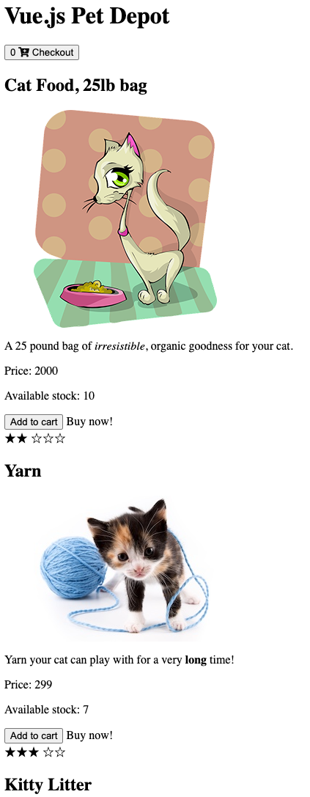

---

# For 'Add to cart' button

* We need to update the `addToCart` function, so it takes the `product` are a input and its ID to the cart
* `addToCart(product) {this.cart.push(product.id);}`
* And the `button` in our html page now looks like:
* `<button v-on:click='addToCart(product)' ... >Add to cart</button>`
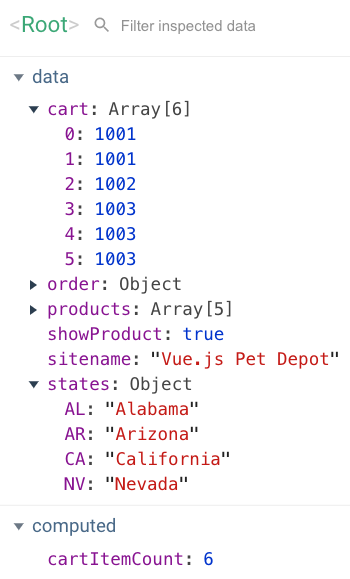

---
* We also need to update the `canAddToCart` computed property
* So it checks the amount of each product in the cart
* First, we need to change it to a method so it can take parameters
  * Computed properties can't have input parameters
```js
methods: {
    ...
    canAddToCart(product) {
        return product.availableInventory > this.cartCount(product.id);
    },
    ...
}
```
* The `cartCount` is a new method that return the number of a product type in the cart
            
---

# The `cartCount` function
```js
cartCount(id) {
    let count = 0;
    for(let i = 0; i < this.cart.length; i++) {
        if (this.cart[i] === id) {
            count++;
        }
    }
    return count;
}
```
* Now we can update the 'Add to cart' button to
* `<button v-on:click = 'addToCart(product)' v-if = 'canAddToCart(product)'>Add to cart</button>`
  
---

# Fixing the inventory message

* The problem is that it still uses the total cart item count to determine which messages to display. 
* We need to change this code so that we now calculate the message based on the cart item count of only that item.
* To fix this issue, let’s change from the `cartItemCount` computed property to our new `cartCount` method

```html
<span v-if='product.availableInventory === cartCount(product.id)'>All out!</span>
<span v-else-if="product.availableInventory - cartCount(product.id) < 5">
    Only {{product.availableInventory - cartCount(product.id)}} left!
</span>
<span v-else>Buy now!</span>
```

---

# Outline

- Condition with `v-if` and `v-if-else`
- Loop with `v-for`
- **Sorting**

---

# Sorting the products by price

* We’ll need to create a computed property `sortedProducts` to return our sorted results
* The `v-for` then uses `sortedProducts` to display the product list
* `<div v-for="product in sortedProducts">`


---

* In this example we will sort by price from low to high
* The actual sorting will use the JavaScript array `sort` method.

```js
computed: {
    sortedProducts() {
        let productsArray = this.products.slice(0);
        function compare(a, b) {
            if (a.price > b.price)
                return 1;
            if (a.price < b.price)
                return -1;
            return 0;
        }
        return productsArray.sort(compare);
    }
}
```
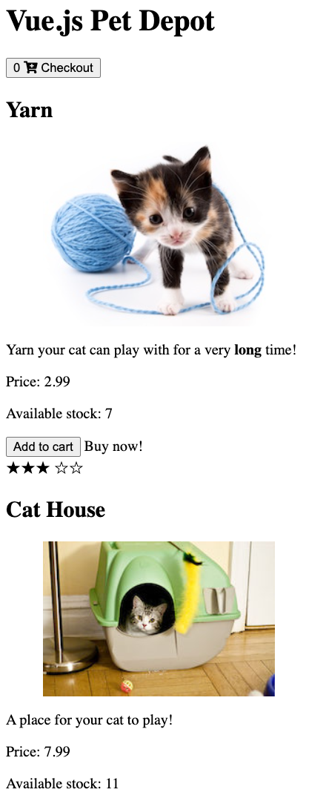

---

# Reading: Chapter 5 of 'Vue.js in Action'